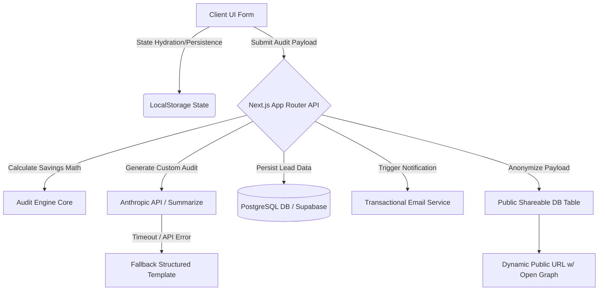

# Architecture - Lead-Generation AI Spend Audit Tool

## System Overview
The **AI Spend Audit Tool** is a high-performance Next.js application designed to act as an advanced lead-generation mechanism for an AI infrastructure enterprise. Startups enter their headcount and existing AI software/API expenses to receive an instant, mathematically defensible audit identifying immediate financial optimizations and credit arbitrage opportunities.

## Design Philosophy & Constraints

### 1. Separation of Financial Logic
*   **Constraint:** Mathematical computation must strictly avoid non-deterministic AI generation.
*   **Implementation:** All savings equations are pre-compiled within `lib/audit-engine.ts` referencing immutable matrices inside `PRICING_DATA.md`. This guarantees zero hallucinations when presenting enterprise-grade cost adjustments.

### 2. High-Conversion Lead Flow ("Value Gate")
*   To prevent drop-off while qualifying robust intent, the frontend utilizes progressive disclosure:
    1.  **Stage 1 (Immediate Gratification):** Displays absolute monthly/annual savings counters directly upon form completion.
    2.  **Stage 2 (The Gate):** Itemized breakdown paths, raw API optimizations, and custom LLM synthesis trigger an overlay requiring a verified business email.

### 3. Fault-Tolerant LLM Integration
*   **Primary Pathway:** `Anthropic API` (Claude 3.5 Sonnet / Haiku) generates a crisp ~100-word bespoke assessment tailored to the user's explicit combination of dev tools.
*   **Circuit Breaker:** If the API times out (>4.5s) or returns rate limits, the client transparently routes to a client-side typed fallback template assembler to maintain seamless UI fidelity.

## Folder Structure & Module Boundaries

*   `app/api/leads/route.ts`: Handles validation, persistent database writes, and email generation payload mapping.
*   `app/api/shares/route.ts`: Extracts Personally Identifiable Information (PII) to yield public sharing hashes.
*   `components/spend-form/`: Controlled React form leveraging persistent hooks (`useEffect` state sync).
*   `components/audit-results/`: Rich UI charts, interactive saving sliders, and custom design tokens adhering to strict HSL standards.
