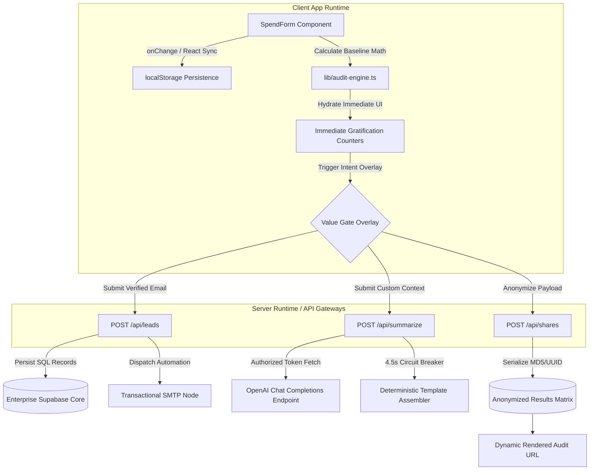

# Architecture - Lead-Generation AI Spend Audit Tool

## System Overview & Diagram

The **AI Spend Audit Tool** functions as a highly optimized, dual-tier application where high-speed client interactions gracefully convert unknown software operators into qualified infrastructure routing targets. 

---

## Detailed Data Flow: From Form Input to Audit Result

1. **Client Event Interception:** As the user adjusts input ranges (e.g., toggling Cursor seats from 0 to 12), controlled React state fires synchronous calculations passing `UserSpendState` objects into `runSpendAudit()`.
2. **Deterministic Rules Evaluation:** The core calculation runtime iterates over target software modules. If duplications exist (e.g., active Copilot and Cursor seats concurrently), the engine zeroes out secondary assistant lines and assigns the exact cost difference to `monthlySavings` arrays.
3. **Progressive Intent Trapping:** Calculated savings immediately render within sticky banner components to establish immediate user trust. However, specific overlap text, LLM summaries, and cloud credit maps remain obscured beneath a glassmorphic blurred screen.
4. **Proxy Route Hydration:** Entering a valid corporate address triggers parallel client invocations to `fetch('/api/summarize')` and `fetch('/api/leads')`. 
5. **Secure External Synthesis:** The server route injects strict system CFO prompt variables alongside the sanitized mathematical breakdown array, sending an authenticated request to downstream completion APIs while keeping API secrets completely invisible to network packet inspectors.
6. **Result Presentation:** Once compiled, the interface unblurs instantly, presenting interactive chart matrices, personalized summary responses, and programmatic public sharing link payloads.

---

## Technical Stack Rationale

### 1. Next.js 16 (App Router)
- **Why:** Allows clean segregation of highly static user-facing marketing boundaries (`/`) from dynamic internal backend handlers (`/api/*`). The build system pre-renders marketing wrappers for zero layout shift (CLS) and premium Search Engine Optimization indexability.

### 2. TypeScript (Strict Mode)
- **Why:** Financial accounting tools cannot tolerate type-coercion bugs. Explicit typing across calculation payload models guarantees runtime safety and predictability during client side hydration loops.

### 3. Vanilla CSS / Tailwind Design Tokens
- **Why:** Enables responsive dark-mode styling utilizing curated HSL palettes. Avoids heavy external CSS frameworks to retain complete visual dominance over micro-animations and smooth layout transitions.

### 4. Native fetch API with Circuit Breakers
- **Why:** Integrating lightweight `AbortController` timeouts ensures web server threads are never kept indefinitely busy waiting for external foundation LLM network backlogs.

---

## Scaling Roadmap: Handling 10,000 Audits per Day

If incoming throughput scales to **10,000 completed audits daily**, the current synchronous backend proxy routing will require three specific infrastructure adjustments to prevent database deadlocks and API limit saturation:

### 1. Edge-Layer Prompt Response Caching
- **Implementation:** Introduce Redis/Vercel KV caching arrays indexing identical combination signatures. If two distinct 15-person startups enter identical tooling matrices, the server bypasses the downstream OpenAI API entirely, returning the pre-synthesized executive summary from memory in `<15ms`.

### 2. Asynchronous Queue Processing for Lead Sinks
- **Implementation:** Offload `/api/leads` database write transactions to background queue workers (e.g., Upstash QStash or RabbitMQ). The API route returns an instant `HTTP 202 Accepted` acknowledgement, protecting primary Supabase connection pools during extreme traffic bursts.

### 3. Read-Replica Routing for Dynamic Shares
- **Implementation:** Because generated share links (`/audit/[shareId]`) are highly viral and read-heavy, database read requests must route to globally distributed read-replicas, keeping primary write nodes completely dedicated to continuous lead tracking.
